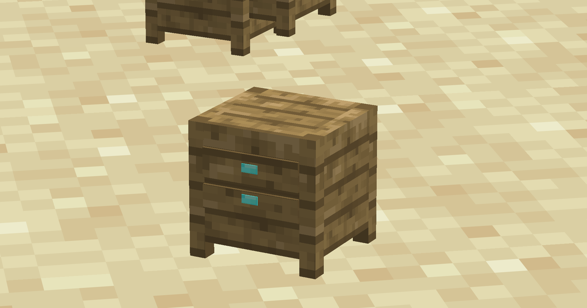

<p align="center">
  
</p>

# Beds, but Endgame

Beds, but Endgame is a Fabric mod for Minecraft Java Edition 26.2 that makes sleeping something the player has to prepare for.

A Bedside Table must be placed next to the head of a bed before the player can sleep. The bed can still be used to set a respawn point without one.

## Features

- Bedside Table block with a custom model and texture
- Sleeping requires a Bedside Table beside the head of the bed
- Either side of the bed head works
- Respawn points can still be set without a Bedside Table
- Directional placement
- Wooden sounds and breaking properties
- Axe as the preferred tool
- Fixed diamond-and-planks recipe

## Bedside Table

<p align="center">
  
</p>

Place the Bedside Table directly to the left or right of the bed's head. A table beside the foot, above, below or diagonally from the bed does not count.

Without a valid table, the respawn point is set normally but sleeping is denied.

## Recipe

<p align="center">
  
</p>

```text
PPP
PDP
P P
```

`P` is any plank and `D` is a diamond. The recipe unlocks after obtaining a diamond.

<details>
<summary>More screenshots</summary>

<p align="center">
  
</p>

</details>

## Planned

- Optional secured-sleep check in a 40x20x40 area around the bed
- Sleep denial when hostile mobs could spawn and pathfind to the player
- Optional disabling of natural insomnia phantom spawning
- Configuration screen

## Inspiration

This mod was inspired by [Harder Beds](https://modrinth.com/mod/harder-beds). I liked its approach to requiring a properly secured shelter before sleeping, but wanted the mechanic to work differently and include a Bedside Table, so I made my own implementation.

## Installation

1. Install Fabric Loader 0.19.3 or newer for Minecraft 26.2.
2. Install Fabric API 0.156.0+26.2 or a compatible newer 26.2 build.
3. Put the mod JAR in the `mods` folder.
4. Start Minecraft with Java 25.

## Testing status

The Bedside Table block, recipe and item rendering have been tested in singleplayer. The new sleep requirement still needs a full in-game test after building version 0.1.2. Dedicated multiplayer has not been tested yet.

## Build from source

Java 25 is required.

```bash
gradle build
```

The installable JAR is written to `build/libs/`.

## License

Beds, but Endgame is available under the MIT License.

<p align="center">
  <br>
  Created by passo.
</p>
