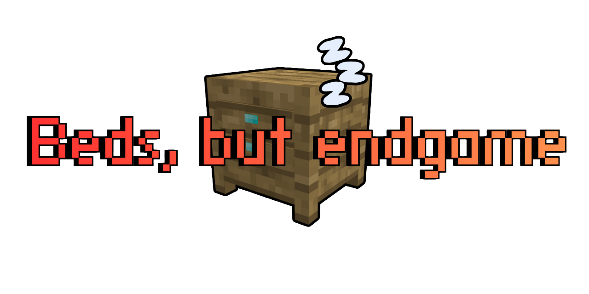
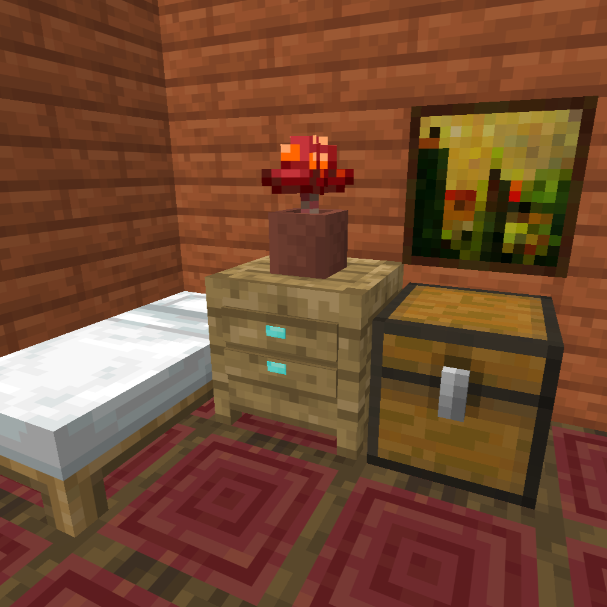
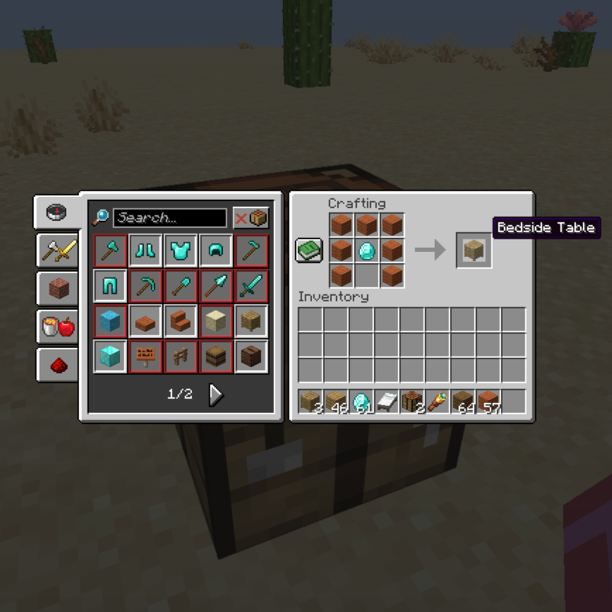

# Beds, but Endgame

Beds, but Endgame is a Fabric challenge mod for Minecraft Java Edition 26.2. It turns sleeping into a progression mechanic built around a new Bedside Table and an optional Soul Lantern upgrade.

## How it works

<p align="center">
  
</p>

Place a Bedside Table directly beside either side of the bed's head. A table beside the foot, placed diagonally, above the bed or below it does not count.

Without a valid table, the bed still sets the player's respawn point but sleeping is denied.

## Features

- Custom Bedside Table block
- Sleeping requires a table beside the bed's head
- Respawn points remain available without a table
- Natural insomnia phantoms can be disabled
- Nightmares can interrupt sleep and lock the player out for the rest of the night
- A Soul Lantern on a valid Bedside Table prevents nightmares
- Shared configuration through Mod Menu and `/bbe` commands

Phantom suppression and nightmares are enabled by default.

## Bedside Table recipe

<p align="center">
  
</p>

```text
PPP
PDP
P P
```

`P` is any item in the vanilla planks tag and `D` is a diamond. The recipe unlocks after the player obtains a diamond.

## Nightmares

Without a Soul Lantern directly on top of either valid Bedside Table, there is a 35% chance of a nightmare.

The player falls asleep normally, then wakes during the same night instead of reaching morning. After a nightmare, that player cannot sleep again until daytime. The lockout is handled separately for each player.

A Soul Lantern prevents nightmares completely.

## Phantom suppression

When enabled, the mod prevents natural insomnia-based phantom spawning. Existing phantoms and phantoms created through commands, spawn eggs or other mechanics are unaffected.

## Configuration

The settings are server-authoritative and saved in:

```text
config/bedsbutendgame.json
```

Default values:

```json
{
  "disablePhantoms": true,
  "nightmares": true
}
```

With Mod Menu installed, the same settings can be changed from the mod list. On multiplayer servers, changing them requires operator permission.

Commands:

```text
/bbe config
/bbe config disablePhantoms <on|off>
/bbe config nightmares <on|off>
```

Command changes are saved immediately and synchronized with the Mod Menu screen.

## Installation

1. Install Fabric Loader 0.19.3 or newer for Minecraft 26.2.
2. Install Fabric API 0.156.0+26.2 or a compatible newer 26.2 build.
3. Put the installable mod JAR in the `mods` folder.
4. Start Minecraft with Java 25.

Mod Menu is optional and only required for the graphical config screen.

## Inspiration

Beds, but Endgame was inspired by [Harder Beds](https://modrinth.com/mod/harder-beds). I liked its approach to making sleep require a properly secured shelter, but wanted the mechanic to function differently and include my own bedside-table progression system, so I created a separate implementation.

## Testing status

The Bedside Table, recipe, item rendering, block outline, collision, lighting and basic sleep requirement have been tested in singleplayer.

Version 0.2.0 adds phantom suppression, nightmares, configuration and commands. These systems still need a full singleplayer and multiplayer test pass before a stable release.

## Build from source

Java 25 and Gradle 9.5.1 are required.

```bash
gradle build
```

The installable JAR is written to `build/libs/`.

## License

Beds, but Endgame is available under the MIT License.


Created by passo.
