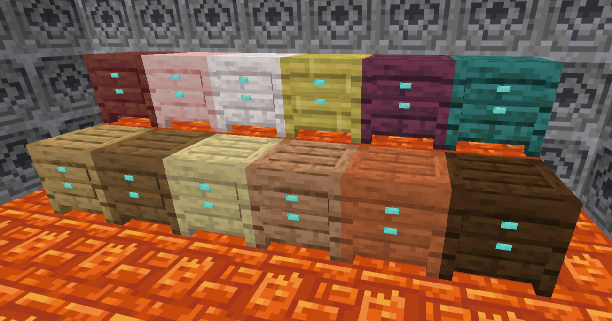
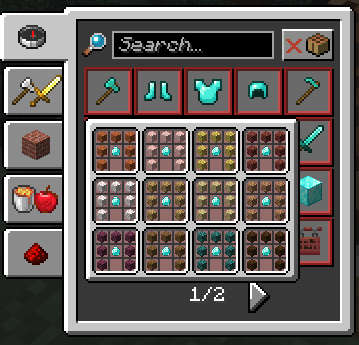

<p align="center">
  
</p>

Beds, but Endgame is a Fabric challenge mod for Minecraft Java Edition 26.2. It makes sleeping require a Bedside Table and adds configurable nightmares, Soul Lantern protection and optional phantom suppression.

## How it works

<p align="center">
  
</p>

Place a Bedside Table directly beside either side of the bed's head. A table beside the foot or placed diagonally does not count.

Without a valid table, the bed still sets the player's respawn point, but sleeping is denied. Vanilla bed behavior in the Nether and End is unchanged.

## Wood variants

<p align="center">
  
</p>

Bedside Tables are available in Oak, Spruce, Birch, Jungle, Acacia, Dark Oak, Mangrove, Cherry, Pale Oak, Bamboo, Crimson and Warped variants.

Each variant uses its matching vanilla plank texture, including textures supplied by resource packs.

## Crafting

<p align="center">
  
</p>

```text
PPP
PDP
P P
```

`P` is one matching plank type and `D` is a diamond. The plank type determines the Bedside Table variant.

<p align="center">
  
</p>

The recipes unlock after obtaining a diamond and share one recipe-book entry.

## Nightmares

Sleeping without a Soul Lantern directly on top of a valid Bedside Table can trigger a nightmare. The player wakes during the night and cannot sleep again until daytime.

A Soul Lantern on either valid Bedside Table prevents nightmares completely. The nightmare chance can be set from 0% to 100%, with 35% as the default. Setting it to 0% disables nightmares.

## Phantom suppression

Natural insomnia phantoms are disabled by default. Existing and manually spawned phantoms are unaffected.

## Configuration

Settings can be changed through Mod Menu or commands:

```text
/bbe config
/bbe config disablePhantoms <on|off>
/bbe config nightmareChance <0-100>
/bbe config reset
```

Mod Menu is optional.

## Installation

1. Install Fabric Loader and Fabric API for Minecraft 26.2.
2. Put the mod JAR in the `mods` folder.
3. Start Minecraft with Java 25.

## Testing status

Tested in singleplayer. Multiplayer has not been tested.

## Inspiration

Beds, but Endgame was inspired by [Harder Beds](https://modrinth.com/mod/harder-beds). I liked its approach to making sleep require a properly secured shelter, but wanted the mechanic to function differently and include my own Bedside Table progression system, so I created a separate implementation.

## Build from source

Java 25 and Gradle 9.5.1 are required.

```bash
gradle build
```

The installable JAR is written to `build/libs/`.

## License

Beds, but Endgame is available under the MIT License.


Created by passo.
